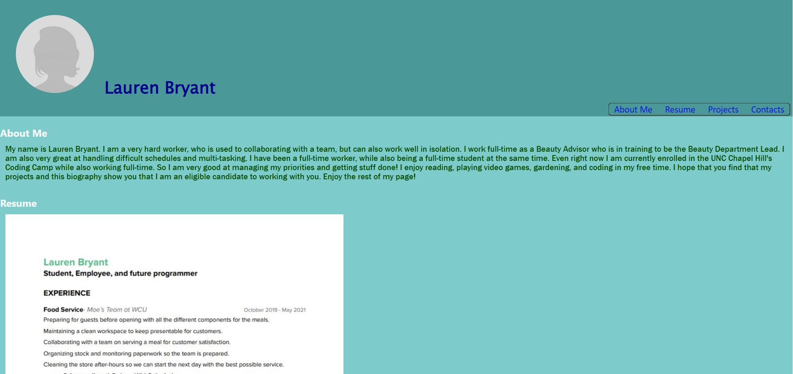

# React_Portfolio


  ## Table of Contents

  * [Installation](#installation)
  * [Links](#links)  
  * [Usage](#usage)
  * [Technologies](#technologies)
  * [Repo Data](#repo)


## Installation
To install the necessary dependencies, run the following command:

```
npm i
```

in the package.json file which is located in the root directory.

### Running the application

Use the command node server.js in the root folder!


## Links

	[Deployed Application]()


## Usage
This is my own personal portfolio created from React. Feel free to look through my projects and message me if you would like to inquire about anything. Thanks!


## Technologies
The application contains the following technologies:

```
react

```


## Repo Data
This repo was contributed by RenBryant. I am a computer science student, a full-time worker, and a coding enthusiast! I love learning new things about computers and how they work and enjoy working on projects. Here is my GitHub Profile! [RenBryant](https://github.com/RenBryant). Thank you for checking out this project!